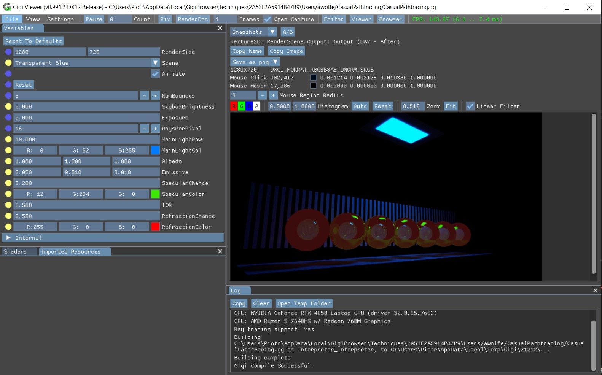

# POiGK Laboratoria 1
Projekt zmodyfikowany na potrzeby laboratoriów z POiGK.
[Lab 2 w rozdziale poniżej](#POiGK Laboratoria 2)

## Przykładowy gameplay

## Zmiany
- Zmiana sterowania na mysz zamiast klawiszami WASD
- Dodanie licznika punktów (10 punktów za zniszczoną asteroidę)
- Zmiana grafiki statku (Podziękowania: <a href="https://www.flaticon.com/free-icons/spaceship" title="spaceship icons">Spaceship icons created by photo3idea_studio - Flaticon</a>)
- Dodanie ekranu końcowego gdy statek zostanie zniszczony
- Dodanie ulepszenia statku po zdobyciu 100 punktów (dodatkowe pociski po bokach statku + napis "Weapon Upgraded" zamiast "Score: __" na trzy sekundy)

## Instrukcja instalacji
1. Pobierz projekt
2. Uruchom "build/Main.exe"

**W razie chęci zmiany kodu**
1. Pobierz projekt
2. Zmodyfikuj plik "source/main.cpp" w folderze
3. Uruchom x64 Native Tools Command Prompt for VS 2022
4. Przejdź do ścieżki projektu za pomocą `cd ścieżka\do\projektu` zastępując ścieżka\do\projektu odpowiednią ścieżką
5. Wpisz `build.bat -release` i naciśnij Enter
6. Uruchom plik "build/Main.exe"

# POiGK Laboratoria 2

Dodano kontrolki do Gigi Viewera a następnie zmodyfikowano wartości dla unikalnego (niekoniecznie ładnego) efektu Shaderów

